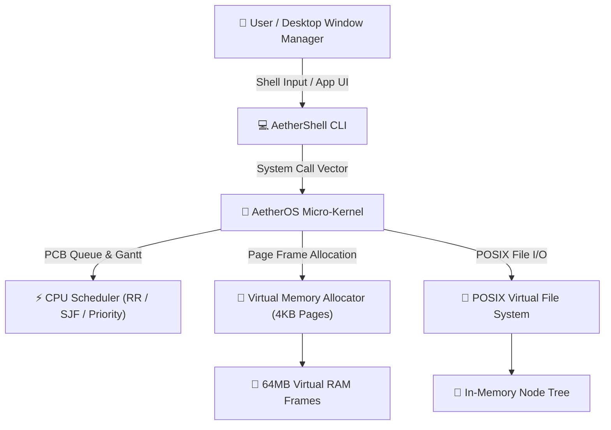

# ⚡ AetherOS – Live Real-Time Web Operating System & Kernel Simulator

[](https://developer.mozilla.org/en-US/docs/Web/JavaScript)
[](core/kernel.js)
[](tests/test_kernel.js)
[](styles.css)
[](LICENSE)

**AetherOS** is a full-featured, interactive **Live Web Operating System and Real-Time Kernel Simulator** built to demonstrate core operating system concepts — process scheduling, virtual memory paging, POSIX virtual file systems, system calls, and desktop window management — directly in a modern web environment.

---

## 🌟 Key Features & OS Subsystems

### 1. 🧠 Micro-Kernel Central Engine (`core/kernel.js`)
- Integrated **System Call Vector Table** (`sys_read`, `sys_write`, `sys_spawn`, `sys_kill`, `sys_ps`, `sys_info`, `sys_mkdir`, `sys_readdir`, `sys_chdir`).
- Real-time uptime monitoring, OS build tracking, and process execution lifecycle management.

### 2. ⚡ CPU Process Scheduler & Gantt Simulator (`core/scheduler.js`)
- Full Process Control Block (PCB) simulation tracking PID, state (`READY`, `RUNNING`, `WAITING`, `TERMINATED`), burst time, remaining time, priority, and memory footprints.
- Supported CPU Scheduling Algorithms:
  - 🔄 **Round-Robin (RR)** (Configurable Time Quantum)
  - ⚡ **Shortest Job First (SJF)**
  - 🥇 **Priority-Based Scheduling**
  - ⏱️ **First-Come First-Served (FCFS)**
- Calculates **Average Waiting Time**, **Turnaround Time**, and renders an interactive **Gantt Chart Timeline**.

### 3. 💾 Virtual Paging Memory Allocator (`core/memory.js`)
- Simulates **64MB Virtual RAM** divided into **4KB Page Frames** (16,384 physical frames).
- Real-time memory allocation, page table mapping, page fault simulation, and dynamic process memory de-allocation.

### 4. 📂 POSIX Virtual File System (VFS) (`core/vfs.js`)
- In-memory hierarchical filesystem (`/bin`, `/etc`, `/home/user`, `/sys`, `/var/log`).
- POSIX-compliant system calls supporting directory creation, file reading/writing, path resolution, and absolute working directory tracking.

### 5. 💻 AetherShell Command Line Interpreter (`core/shell.js`)
- Interactive terminal CLI with built-in commands:
  - `sysinfo`, `ps`, `spawn`, `kill`, `mem`, `bench`, `ls`, `cd`, `cat`, `write`, `mkdir`, `rm`, `pwd`, `clear`, `date`, `version`.

### 6. 🪟 Cyberpunk Glassmorphism Window Manager & GUI (`gui/window_manager.js`)
- Multi-window Desktop Environment with draggable header bars, resizable containers, z-index focus layering, minimizing, maximizing, Taskbar integration, and Start Menu.
- **Built-in Desktop Apps**:
  - 💻 **Terminal Shell App**
  - 📂 **File Explorer App**
  - 📊 **Resource & Process Monitor App**
  - ⚡ **CPU Scheduling Benchmark Simulator**
  - 📝 **Text Editor / Notepad App**
  - ⚙️ **System Settings App**

---

## 🏗️ System Architecture



---

## 🧪 Automated Kernel Test Results

Run tests via Node.js:

```bash
node tests/test_kernel.js
```

Test Results Output:
```
==========================================
🧪 Running AetherOS Kernel Verification Suite
==========================================

✅ PASS: VFS Root Initialization
✅ PASS: VFS Directory Creation (/home/user/Projects)
✅ PASS: VFS File Writing
✅ PASS: VFS File Reading Content Verification
✅ PASS: Memory Manager Kernel Initial Reservation
✅ PASS: VMM Allocation (8MB Paged)
✅ PASS: VMM De-allocation & Frame Recycling
✅ PASS: CPU Scheduler PCB Creation
✅ PASS: Round-Robin CPU Scheduler Simulation
✅ PASS: SJF Optimization Efficiency Verification
✅ PASS: Shell command 'sysinfo'
✅ PASS: Shell command 'ps'
✅ PASS: Shell command 'spawn Calculator'
✅ PASS: Shell command 'bench'

==========================================
Test Execution Summary: 14 Passed, 0 Failed
==========================================
```

---

## 🚀 Running the Live Operating System

1. Open [`index.html`](index.html) in any modern web browser (Chrome, Firefox, Edge, Safari).
2. Enjoy the live desktop environment!
   - Launch apps from the Desktop icons or Start Menu.
   - Run CPU Scheduling simulations in the **CPU Scheduler** app.
   - Execute terminal commands like `sysinfo`, `bench`, `ps`, `ls`, and `mem` inside **AetherShell**.
   - Create and edit files in **File Explorer** and **Text Editor**.

---

## 📄 License

This project is licensed under the **MIT License**.
